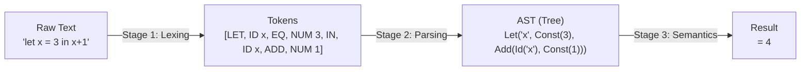
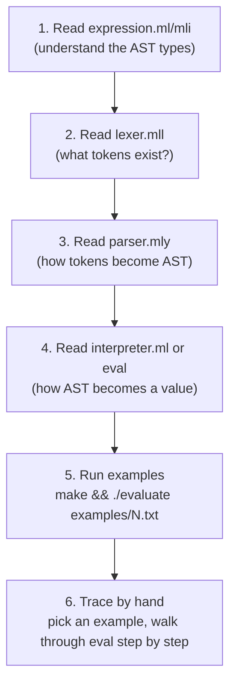

# Structured Plan to Understand the PLDI Codebase

> [!IMPORTANT]
> This codebase teaches you **how a programming language is built from scratch** in OCaml — from raw text to a running interpreter. It follows the classic 3-stage compiler/interpreter pipeline. You suggested starting with Semantics, but I recommend the order below since each stage feeds into the next.

---

## The Big Picture



The three folders `la/`, `parsing/`, `semantics/` map 1:1 to these stages.

---

## Phase 1: Lexical Analysis (`la/`) — ~2 hours

**Goal**: Understand how raw text becomes tokens (meaningful chunks).

### Step 1.1 — FSMs as OCaml Functions (`la/fsm/`)
| File | What to study | Key concept |
|------|--------------|-------------|
| [fsm.ml](file:///Users/krishdave/Documents/Krish%20Stuff/8th%20Semester/Programming%20Languages/Pratham_Codes/Programming-Languages/PLDI/la/fsm/fsm.ml) | `one_zero` and `id` functions | **Mutual recursion** = FSM states. Each function IS a state; calling another function IS a transition. |

> [!TIP]
> **Exercise**: Trace `one_zero [1; 1; 0; 0]` by hand. Draw the FSM states on paper. Then trace `id "foo42"`.

### Step 1.2 — Hand-written Modular Lexer (`la/manual/`)

Read in this exact order (bottom-up by dependency):

| Order | File | Key concept |
|-------|------|-------------|
| 1 | [mystream.ml](file:///Users/krishdave/Documents/Krish%20Stuff/8th%20Semester/Programming%20Languages/Pratham_Codes/Programming-Languages/PLDI/la/manual/mystream.ml) | **Lazy streams** — `Cons(head, thunk)` produces elements on demand |
| 2 | [state.ml](file:///Users/krishdave/Documents/Krish%20Stuff/8th%20Semester/Programming%20Languages/Pratham_Codes/Programming-Languages/PLDI/la/manual/state.ml) | **Scanner return type** — `Terminate(bool)` or `State(next_function)` |
| 3 | [id.ml](file:///Users/krishdave/Documents/Krish%20Stuff/8th%20Semester/Programming%20Languages/Pratham_Codes/Programming-Languages/PLDI/la/manual/id.ml) | **Lookahead** — peeks one char ahead to decide continue vs. stop |
| 4 | [num.ml](file:///Users/krishdave/Documents/Krish%20Stuff/8th%20Semester/Programming%20Languages/Pratham_Codes/Programming-Languages/PLDI/la/manual/num.ml) | Same pattern for numbers (including decimals) |
| 5 | [lexer.ml](file:///Users/krishdave/Documents/Krish%20Stuff/8th%20Semester/Programming%20Languages/Pratham_Codes/Programming-Languages/PLDI/la/manual/lexer.ml) | **The orchestrator** — runs ALL scanners in parallel, picks longest match |

> [!IMPORTANT]
> **Key insight in `lexer.ml`**: The `lexer_data` record tracks all running scanners simultaneously. Each iteration feeds one character to every active scanner. Scanners that fail get removed; the first to succeed updates `current_token`. This implements the **longest-match policy**.

### Step 1.3 — Auto-generated Lexer (`la/auto/`)
| File | Key concept |
|------|-------------|
| [conv_lexer.mll](file:///Users/krishdave/Documents/Krish%20Stuff/8th%20Semester/Programming%20Languages/Pratham_Codes/Programming-Languages/PLDI/la/auto/conv_lexer.mll) | **`ocamllex`** — you write regex patterns, the tool generates the FSM code for you. Three sections: header `{ }`, rules, footer `{ }` |

> [!TIP]
> Compare `la/manual/` (hundreds of lines) vs `la/auto/` (27 lines of rules). Same result, 10× less code. That's why parser generators exist.

---

## Phase 2: Parsing (`parsing/`) — ~2 hours

**Goal**: Understand how a flat token list becomes a structured tree (AST).

### Step 2.1 — Prefix Parser (`parsing/prefix.ml`)
| What to study | Key concept |
|--------------|-------------|
| [prefix.ml](file:///Users/krishdave/Documents/Krish%20Stuff/8th%20Semester/Programming%20Languages/Pratham_Codes/Programming-Languages/PLDI/parsing/prefix.ml) | **Recursive descent** in its simplest form. `+ 1 2` → see operator, recursively parse two operands. Returns `(ast, remaining_tokens)`. |

> [!TIP]
> **Exercise**: Trace `parse_prefix [Op(PLUS); Op(DIV); NUM(6); NUM(2); NUM(1)]` by hand. What tree do you get? What's the infix?

### Step 2.2 — Lambda Calculus Parser (`parsing/parse-lambda.ml`)
| What to study | Key concept |
|--------------|-------------|
| [parse-lambda.ml](file:///Users/krishdave/Documents/Krish%20Stuff/8th%20Semester/Programming%20Languages/Pratham_Codes/Programming-Languages/PLDI/parsing/parse-lambda.ml) | **Backtracking** — tries abstraction, then identifier, then application. Uses `try/with` to recover from failures. Only 3 constructs build ALL of computation! |

### Step 2.3 — Recursive Descent with Backtracking (`parsing/manual/`)
| What to study | Key concept |
|--------------|-------------|
| [rdparser.ml](file:///Users/krishdave/Documents/Krish%20Stuff/8th%20Semester/Programming%20Languages/Pratham_Codes/Programming-Languages/PLDI/parsing/manual/rdparser.ml) | Grammar `S ::= c A d`, `A ::= ab | a`. Demonstrates **backtracking**: tries `A1`, if it fails, rewinds position and tries `A2`. |

### Step 2.4 — Auto-generated Parser (`parsing/auto/`)

Read in this order:

| Order | File | Key concept |
|-------|------|-------------|
| 1 | [expr_type.ml](file:///Users/krishdave/Documents/Krish%20Stuff/8th%20Semester/Programming%20Languages/Pratham_Codes/Programming-Languages/PLDI/parsing/auto/expr_type.ml) | AST type definition — `Num | Add | Mul` |
| 2 | [lexer.mll](file:///Users/krishdave/Documents/Krish%20Stuff/8th%20Semester/Programming%20Languages/Pratham_Codes/Programming-Languages/PLDI/parsing/auto/lexer.mll) | Lexer spec — produces `Parser.NUM`, `Parser.ADD`, etc. |
| 3 | [parser.mly](file:///Users/krishdave/Documents/Krish%20Stuff/8th%20Semester/Programming%20Languages/Pratham_Codes/Programming-Languages/PLDI/parsing/auto/parser.mly) | **`ocamlyacc` grammar** — `expr → term EOF`, `term → factor | factor + term`, `factor → NUM | NUM * factor`. **Precedence is encoded in the grammar structure** (factor binds tighter than term). |

> [!IMPORTANT]
> **This is the critical link**: `parsing/auto/` shows how `ocamllex` + `ocamlyacc` work together. The lexer produces tokens, the parser consumes them according to grammar rules and builds the AST. Every `semantics/` interpreter reuses this exact pattern.

---

## Phase 3: Semantics (`semantics/`) — ~4 hours

**Goal**: Understand how an AST is evaluated to produce a result. Each subfolder is a **complete interpreter** that adds one feature to the previous one.

### Step 3.1 — `const/` — Pure Arithmetic (Simplest Interpreter)

| File | What to study |
|------|--------------|
| [expression.ml](file:///Users/krishdave/Documents/Krish%20Stuff/8th%20Semester/Programming%20Languages/Pratham_Codes/Programming-Languages/PLDI/semantics/const/expression.ml) | AST: `Const | Add | Subtract`. The `eval` function is just pattern matching + recursion. **No environment needed** because there are no variables. |

```
eval(Add(Const(3), Const(4))) → eval(Const(3)) + eval(Const(4)) → 3 + 4 → 7
```

### Step 3.2 — `if/` — Adding Conditionals

| File | What changed |
|------|-------------|
| [expression.ml](file:///Users/krishdave/Documents/Krish%20Stuff/8th%20Semester/Programming%20Languages/Pratham_Codes/Programming-Languages/PLDI/semantics/if/expression.ml) | Adds `IfExpr of bool * expr * expr`. Note: condition is a **literal bool**, not an expression yet. |

### Step 3.3 — `if_bool/` — Boolean Expressions

| File | What changed |
|------|-------------|
| [expression.ml](file:///Users/krishdave/Documents/Krish%20Stuff/8th%20Semester/Programming%20Languages/Pratham_Codes/Programming-Languages/PLDI/semantics/if_bool/expression.ml) | **Two separate types**: `bool_expr` and `expr`. Now conditions can be compound: `And(Boolean true, Not(Boolean false))`. Introduces `bool_eval` alongside `eval`. |

### Step 3.4 — `let/` — Variables & Environments ⭐

| File | What changed |
|------|-------------|
| [expression.ml](file:///Users/krishdave/Documents/Krish%20Stuff/8th%20Semester/Programming%20Languages/Pratham_Codes/Programming-Languages/PLDI/semantics/let/expression.ml) | Adds `Id of string` and `LetExpr of string * expr * expr`. **`eval` now takes an `env` parameter.** |
| [env.ml](file:///Users/krishdave/Documents/Krish%20Stuff/8th%20Semester/Programming%20Languages/Pratham_Codes/Programming-Languages/PLDI/semantics/let/env.ml) | The environment module: `addBinding` and `apply` (lookup). |
| [let-semantics.txt](file:///Users/krishdave/Documents/Krish%20Stuff/8th%20Semester/Programming%20Languages/Pratham_Codes/Programming-Languages/PLDI/semantics/let/let-semantics.txt) | Formal inference rules |

> [!IMPORTANT]
> **This is the conceptual leap**: `let x = e1 in e2` means "evaluate `e1`, bind result to `x`, then evaluate `e2` in the extended environment." The environment is a linked list — new bindings go at the front, shadowing old ones (**lexical scoping**).

### Step 3.5 — `let2/` — Refactoring for Extensibility

| File | What changed |
|------|-------------|
| [interpreter.ml](file:///Users/krishdave/Documents/Krish%20Stuff/8th%20Semester/Programming%20Languages/Pratham_Codes/Programming-Languages/PLDI/semantics/let2/interpreter.ml) | `eval` now returns `Expression.expr` (not raw `int`). Separate `getIntConstValue`/`getBoolConstValue` extractors. This is a **structural refactor** to prepare for closures. |

### Step 3.6 — `proc/` — First-Class Functions (Closures) ⭐⭐

| File | What to study |
|------|--------------|
| [expression.ml](file:///Users/krishdave/Documents/Krish%20Stuff/8th%20Semester/Programming%20Languages/Pratham_Codes/Programming-Languages/PLDI/semantics/proc/expression.ml) | Adds `FunDef`, `FunApp`, `Closure`. A `Closure` = `(param, body, captured_env)`. |
| [interpreter.ml](file:///Users/krishdave/Documents/Krish%20Stuff/8th%20Semester/Programming%20Languages/Pratham_Codes/Programming-Languages/PLDI/semantics/proc/interpreter.ml) | `FunDef(x, body)` → `Closure(x, body, env)` (captures current env). `FunApp(f, arg)` → evaluate `f` to get closure, evaluate `arg`, extend closure's env, evaluate body. |
| [proc-semantics.txt](file:///Users/krishdave/Documents/Krish%20Stuff/8th%20Semester/Programming%20Languages/Pratham_Codes/Programming-Languages/PLDI/semantics/proc/proc-semantics.txt) | Two inference rules: FunDef and FunApp |

> [!IMPORTANT]
> **The closure is the key idea**: When `fun x -> x + y` is evaluated where `y=3`, the closure **captures** `{y=3}`. Later, when called with `arg=5`, the body runs in `{x=5, y=3}` — the closure's env, NOT the caller's env. This is **lexical scoping**.

### Step 3.7 — `letrec/` — Recursive Functions ⭐⭐⭐

| File | What to study |
|------|--------------|
| [expression.ml](file:///Users/krishdave/Documents/Krish%20Stuff/8th%20Semester/Programming%20Languages/Pratham_Codes/Programming-Languages/PLDI/semantics/letrec/expression.ml) | Adds `RecFunDef`, `RecClosure`. The `apply` function has special handling: when looking up a RecClosure, it **re-injects the function into its own environment** before returning. |
| [interpreter.ml](file:///Users/krishdave/Documents/Krish%20Stuff/8th%20Semester/Programming%20Languages/Pratham_Codes/Programming-Languages/PLDI/semantics/letrec/interpreter.ml) | Full evaluator with all features |
| [letrec-semantics.txt](file:///Users/krishdave/Documents/Krish%20Stuff/8th%20Semester/Programming%20Languages/Pratham_Codes/Programming-Languages/PLDI/semantics/letrec/letrec-semantics.txt) | Four inference rules: FunDef, FunApp, LetRec, ApplyFound |
| [reduction-14.txt](file:///Users/krishdave/Documents/Krish%20Stuff/8th%20Semester/Programming%20Languages/Pratham_Codes/Programming-Languages/PLDI/semantics/letrec/reduction-14.txt) | **Hand-traced evaluation of `fact 3`** — step by step |

> [!IMPORTANT]
> **The recursion trick**: A normal `Closure` can't call itself because its env was captured BEFORE it was bound to a name. A `RecClosure` solves this: when you look up `fact`, the `apply` function adds `fact → RecClosure(...)` back into the closure's env, then returns a normal `Closure`. Now when the body calls `fact`, it finds itself!

---

## Recommended Study Workflow



For **each** semantics subfolder, follow steps 1→6 above.

---

## Feature Evolution Summary

| Folder | New AST Nodes | New Concept | Env? |
|--------|--------------|-------------|------|
| `const/` | `Const, Add, Subtract` | Pattern matching + recursion | ❌ |
| `if/` | `IfExpr(bool, e, e)` | Branching (literal condition) | ❌ |
| `if_bool/` | `Boolean, And, Or, Not` | Two-type system (bool + int) | ❌ |
| `let/` | `Id, LetExpr` | **Environment** (name→value map) | ✅ |
| `let2/` | *(same as let)* | Refactor: eval returns `expr` not `int` | ✅ |
| `proc/` | `FunDef, FunApp, Closure` | **Closures** (functions as values) | ✅ |
| `letrec/` | `RecFunDef, RecClosure, Multiply` | **Recursive closures** (self-reference) | ✅ |

---

## If You Want to Start with Semantics (Your Preference)

You absolutely can start at `semantics/const/` and work forward — the lexer/parser files in each folder use the same `ocamllex`/`ocamlyacc` pattern. Just know that:
- The `.mll` and `.mly` files will feel like "magic" until you study Phase 1 and 2
- Focus on `expression.ml` and `interpreter.ml` — those are the semantic core
- Treat `lexer.mll` and `parser.mly` as "given infrastructure" for now

Then circle back to `la/` and `parsing/` to demystify how the input text actually reaches the evaluator.
