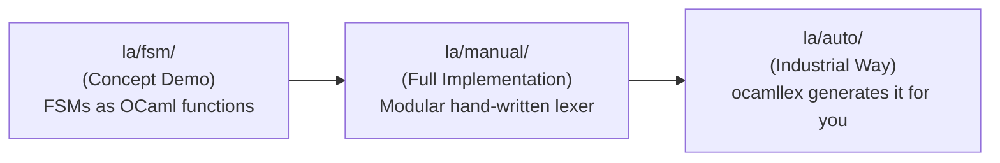
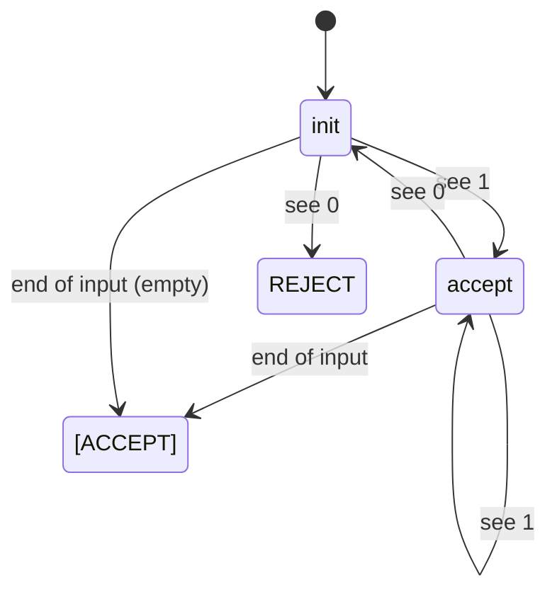
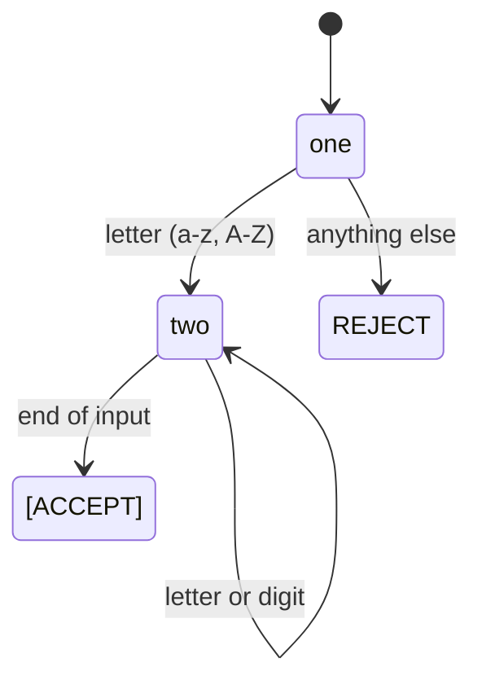
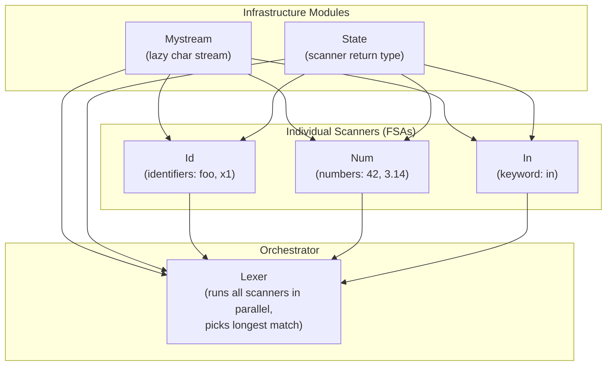
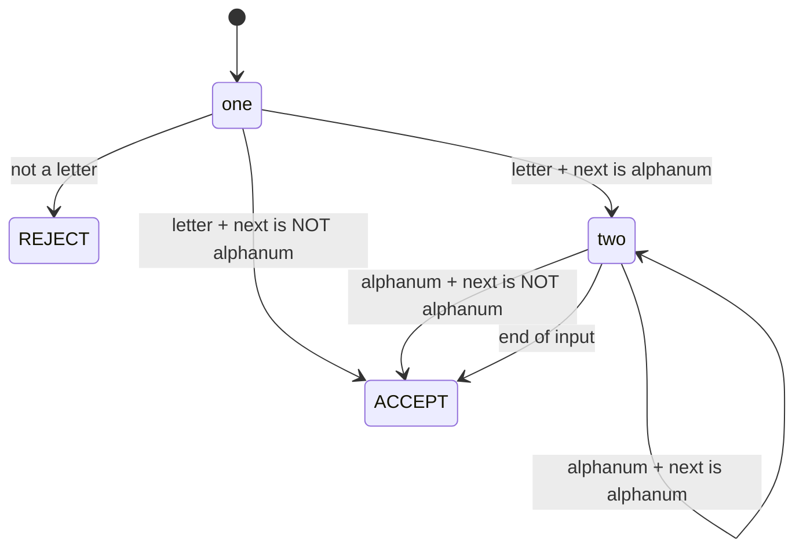
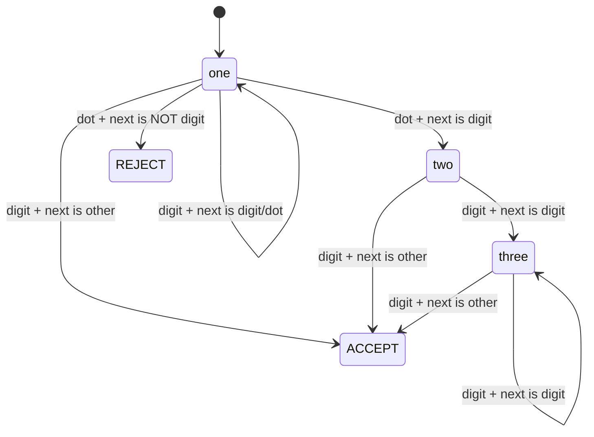
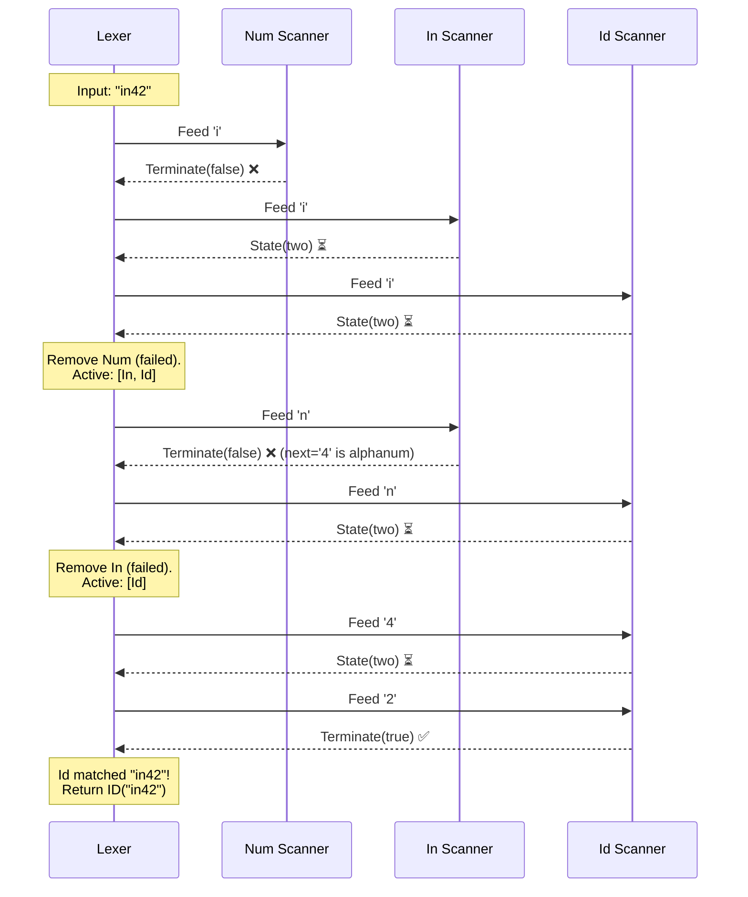
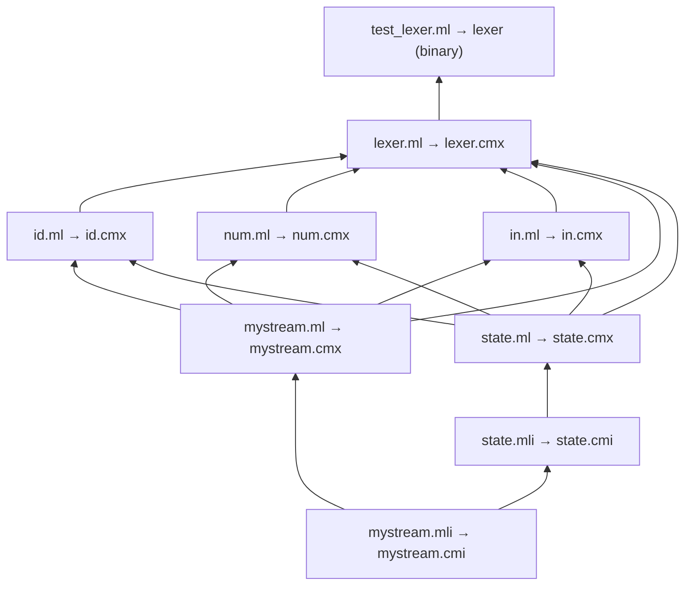
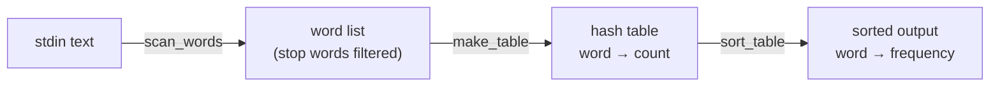

# Deep Dive: Lexical Analysis (`la/` folder)

## What is Lexical Analysis?

A **lexer** (or scanner) reads raw text character-by-character and groups them into **tokens** — meaningful chunks that the parser can work with.

```
Input:   "let x = 3.14 in x"

Lexer →  [LET, ID("x"), EQUALS, NUM(3.14), IN, ID("x")]
```

The `la/` folder teaches this concept in **three progressively complex ways**:



---

---

# 1. `la/fsm/` — FSMs as OCaml Functions (Concept Demo)

> **Purpose**: Show that a **Finite State Machine** is just **mutually recursive functions**.

## [fsm.ml](file:///Users/krishdave/Documents/Krish%20Stuff/8th%20Semester/Programming%20Languages/Pratham_Codes/Programming-Languages/PLDI/la/fsm/fsm.ml) — Two FSM examples

### FSM 1: `one_zero` — Accepts strings where all 1s come before all 0s

```
Valid:   [1;1;0;0] → true     []  → true     [1;1;1] → true
Invalid: [0;1]     → false    [1;0;1] → false
```

The FSM has two states, each implemented as a **function**:



Here's the code with annotations:

```ocaml
let one_zero lst =
  (* STATE 1: init — expecting 1s *)
  let rec init l =
    match l with
      []     -> true                    (* empty input = accept *)
    | h :: t -> if h = 1 then (accept t)  (* saw 1 → transition to 'accept' state *)
                else false                (* saw 0 first → reject *)

  (* STATE 2: accept — saw at least one 1, now allowing 0s too *)
  and accept l =
    match l with
      []     -> true                    (* all consumed = accept *)
    | h :: t ->
      if h = 0 then (init t)           (* saw 0 → go back to init *)
      else if h = 1 then (accept t)    (* saw 1 → stay in accept *)
      else false
  in
  init lst                             (* start in init state *)
```

> [!IMPORTANT]
> **The fundamental insight**: Each OCaml function IS a state. A function call IS a state transition. Mutual recursion (`let rec ... and ...`) is how states refer to each other. This is the foundation of EVERYTHING in the `la/` folder.

### FSM 2: `id` — Accepts valid identifiers (letter followed by letters/digits)

```
Valid:   "x" "myVar" "foo42"
Invalid: "123abc" (starts with digit)   "_x" (underscore)
```



Same pattern — `one` requires a letter, `two` loops on letters/digits.

**Helper function**: `list_of_string` converts `"hello"` → `['h';'e';'l';'l';'o']` because OCaml's pattern matching works on lists, not strings.

---

## [tree.ml](file:///Users/krishdave/Documents/Krish%20Stuff/8th%20Semester/Programming%20Languages/Pratham_Codes/Programming-Languages/PLDI/la/fsm/tree.ml) — Mutual recursion on trees

This file isn't about lexing — it's a **side example** of mutual recursion on a data structure:

```ocaml
type tree   = Leaf | Node of int * forest     (* a tree has children = a forest *)
and  forest = Empty | Cons of tree * forest   (* a forest is a list of trees *)
```

`sum_tree` and `sum_forest` call each other — same mutual recursion pattern as the FSMs. It's here to reinforce the concept.

---

---

# 2. `la/manual/` — Hand-Written Modular Lexer (The Real Deal)

> **Purpose**: Build a production-quality lexer from scratch, piece by piece, with clear module interfaces and unit tests. This is the most important subfolder.

## Architecture Overview



Each `.ml` file has a matching `.mli` (interface) file. The `.mli` defines **what the module exposes** — types and function signatures — without revealing implementation details. This is OCaml's module system enforcing encapsulation.

---

## Module 1: [mystream.ml](file:///Users/krishdave/Documents/Krish%20Stuff/8th%20Semester/Programming%20Languages/Pratham_Codes/Programming-Languages/PLDI/la/manual/mystream.ml) — Lazy Character Stream

**Problem**: We need to read input character by character, with the ability to "peek ahead" without consuming characters.

**Solution**: A lazy stream using **thunks** (delayed computation).

```ocaml
type 'a mystream =
    End                                    (* stream is empty *)
  | Cons of 'a * (unit -> 'a mystream)    (* head + thunk for rest *)
```

The key is the second part of `Cons`: it's NOT the rest of the stream, it's a **function that produces the rest when called**. This means elements are generated on demand.

### How `string_stream` works:

```
string_stream "hi"
  → Cons('h', fun () -> Cons('i', fun () -> End))
```

The character `'i'` doesn't exist yet — it only gets created when you call the thunk:

```ocaml
let s = string_stream "hi"
(* s = Cons('h', <thunk>) *)

let rest = (tl s) ()         (* call the thunk *)
(* rest = Cons('i', <thunk>) *)

let rest2 = (tl rest) ()
(* rest2 = End *)
```

### Three operations:

| Function | Type | What it does |
|----------|------|-------------|
| `hd` | `'a mystream -> 'a` | Returns the head element |
| `tl` | `'a mystream -> unit -> 'a mystream` | Returns the thunk (call it with `()` to get the rest) |
| `string_stream` | `string -> char mystream` | Converts `"abc"` into a lazy char stream |

> [!TIP]
> **Why lazy?** Because the lexer needs to "peek ahead" without committing. If a scanner peeks at the next char and decides it doesn't want it, the char hasn't been consumed — you just don't call the thunk again. This is crucial for the lookahead pattern used in every scanner.

---

## Module 2: [state.ml](file:///Users/krishdave/Documents/Krish%20Stuff/8th%20Semester/Programming%20Languages/Pratham_Codes/Programming-Languages/PLDI/la/manual/state.ml) — Scanner Return Type

Every scanner (FSA) returns one of three things after looking at a character:

```ocaml
type state =
    Terminate of bool                            (* done scanning *)
  | State of (char Mystream.mystream -> state)   (* still going *)
```

| Return value | Meaning |
|---|---|
| `Terminate(true)` | ✅ "I matched a valid token. Stop." |
| `Terminate(false)` | ❌ "This isn't my token. Discard me." |
| `State(f)` | ⏳ "I need more input. Call `f` with the next chunk of stream." |

> [!IMPORTANT]
> **This is the decoupling trick**: Scanners don't consume characters themselves. They just say "I'm done" or "give me more." The **Lexer** (orchestrator) is the one who actually advances the stream and feeds characters to scanners. This lets the lexer run multiple scanners simultaneously on the same input.

---

## Module 3: [id.ml](file:///Users/krishdave/Documents/Krish%20Stuff/8th%20Semester/Programming%20Languages/Pratham_Codes/Programming-Languages/PLDI/la/manual/id.ml) — Identifier Scanner

Recognises identifiers: must start with a letter, followed by letters or digits.

**Two states**: `one` (need first letter) → `two` (consuming rest)



### The Lookahead Pattern (used in every scanner):

```ocaml
let rec one (stream : char Mystream.mystream) : State.state =
  match stream with
    Mystream.End -> State.Terminate(false)         (* empty = reject *)
  | Mystream.Cons(c, _) ->
      let lookahead = (Mystream.tl stream) () in   (* ← PEEK at next char *)
      if is_alpha c then
        match lookahead with
          Mystream.Cons(c', _) ->                  (* c' = next character *)
            if (is_alphanum c') then
              State.State(two)                     (* more chars coming → continue *)
            else
              State.Terminate(true)                (* next char ends the token → accept *)
        | Mystream.End ->
            State.Terminate(true)                  (* end of input → accept *)
      else
        State.Terminate(false)                     (* not a letter → reject *)
```

> [!IMPORTANT]
> **Why lookahead?** The scanner needs to know: "Should I return `State(next)` (keep going) or `Terminate(true)` (I'm done)?" It can only decide by **peeking at the next character**. If the next char is still part of the token, keep going. If it's not (space, operator, end), the token is complete.

---

## Module 4: [num.ml](file:///Users/krishdave/Documents/Krish%20Stuff/8th%20Semester/Programming%20Languages/Pratham_Codes/Programming-Languages/PLDI/la/manual/num.ml) — Number Scanner

Recognises integers and decimals: `42`, `3.14`, `.5`
Rejects: `.` (lone dot), `1.` (trailing dot), `B`

**Three states**:



| State | What it's doing | Valid transitions |
|-------|----------------|-------------------|
| `one` | Reading integer digits (before `.`) | digit→`one`, `.`→`two` |
| `two` | Just saw `.`, MUST see at least one digit | digit→`three` |
| `three` | Reading digits after `.` | digit→`three` |

The code uses the **exact same lookahead pattern** as `id.ml`. Each state peeks at the next character to decide continue vs. terminate.

---

## Module 5: [in.ml](file:///Users/krishdave/Documents/Krish%20Stuff/8th%20Semester/Programming%20Languages/Pratham_Codes/Programming-Languages/PLDI/la/manual/in.ml) — Keyword `in` Scanner

Recognises the keyword `in` but NOT `into`, `inn`, `in1` (those are identifiers).

**Two states**: `one` (expect `i`) → `two` (expect `n`, then check next char)

The critical logic in state `two`:

```ocaml
if (c = 'n') then
   match lookahead with
    Mystream.Cons(c', _) ->
      if (is_alphanum c') then
        State.Terminate(false)     (* "in" followed by letter/digit → it's an identifier! *)
      else
        State.Terminate(true)      (* "in" followed by space/operator → it's the keyword *)
  | Mystream.End -> State.Terminate(true)  (* "in" at end → accept *)
```

> [!TIP]
> This is why keywords need their own scanner: `"in"` could be the keyword OR the start of `"integral"`. The scanner must check what follows to decide.

---

## Module 6: [lexer.ml](file:///Users/krishdave/Documents/Krish%20Stuff/8th%20Semester/Programming%20Languages/Pratham_Codes/Programming-Languages/PLDI/la/manual/lexer.ml) — The Orchestrator ⭐

This is the **most important file** — it ties everything together.

### Token type:
```ocaml
type token = NUM of float | ID of string | IN
```

### The `lexer_data` record — what gets tracked each iteration:
```ocaml
type lexer_data = {
  current_token : token option;           (* best match so far (None = nothing yet) *)
  lexeme        : string;                 (* the text of the best match *)
  input_string  : string;                 (* all text consumed so far *)
  current_input : char Mystream.mystream; (* remaining stream *)
  scanners      : (token * State.state) list  (* active scanners *)
}
```

### How it works — the algorithm:



### The iteration loop (simplified):

```
1. Start with ALL scanners active: [NUM, IN, ID]
2. For each character in the input:
   a. Feed the character to every active scanner
   b. Scanners that Terminate(false) → REMOVE them
   c. Scanners that Terminate(true) → RECORD this as the current best match
   d. Scanners that return State(f) → KEEP them for next iteration
3. Stop when: all scanners terminated OR input is exhausted
4. Return the recorded best match (or fail if none)
```

### The critical line — scanner initialization (line 130):

```ocaml
scanners = [
  (NUM(0.), State.State(Num.num));       (* Num scanner first *)
  (IN,      State.State(In.keywd_in));   (* In scanner second *)
  (ID(""),  State.State(Id.id))          (* Id scanner last *)
]
```

> [!WARNING]
> **Order matters!** When multiple scanners succeed on the same input, the **first** one wins. `IN` appears before `ID` so that `"in"` is tokenised as the keyword `IN`, not as the identifier `ID("in")`. If you swapped them, `"in"` would always be recognised as an identifier!

### Two important policies encoded in this design:

| Policy | How it works |
|--------|-------------|
| **Longest match** | The lexer doesn't stop at the first success. It keeps going as long as any scanner is still active. Only when ALL scanners terminate does it return the last successful match. So `"integral"` matches `ID("integral")`, not `IN`. |
| **Priority ordering** | When two scanners match the same lexeme, the one earlier in the list wins. So `"in"` returns `IN`, not `ID("in")`. |

### After the loop — extracting the actual value (lines 138-144):

```ocaml
match tok with
  NUM(_) -> (NUM(float_of_string st.lexeme), st.current_input)
| ID(_)  -> (ID(st.lexeme), st.current_input)
| IN     -> (IN, st.current_input)
```

The scanner's initial token value (e.g., `NUM(0.)`) was just a placeholder. The real value is reconstructed from the `lexeme` string.

---

## Testing: [test_lexer.ml](file:///Users/krishdave/Documents/Krish%20Stuff/8th%20Semester/Programming%20Languages/Pratham_Codes/Programming-Languages/PLDI/la/manual/test_lexer.ml)

```ocaml
let inputs = ["A"; "Bb"; "BbB"; "C1"; "Dd2"; "E3e"; "f4"; "5g"; "G_";
              "6"; "7.7"; "88.8"; "99.99"; ".11"; "."; "1."; "in"; "integral"]
```

Expected results:

| Input | Result | Why |
|-------|--------|-----|
| `"A"` | `ID("A")` ✅ | Single letter = valid identifier |
| `"C1"` | `ID("C1")` ✅ | Letter + digit |
| `"5g"` | `NUM(5.)` ✅ | Starts with digit, so Num scanner wins. `g` is left unconsumed |
| `"G_"` | `ID("G")` ✅ | Underscore not allowed, so only `G` is matched |
| `"7.7"` | `NUM(7.7)` ✅ | Decimal number |
| `"."`  | ❌ | Lone dot = no scanner matches |
| `"1."` | `NUM(1.)` ✅ | Num scanner accepts `1`, dot is leftover |
| `"in"` | `IN` ✅ | Keyword scanner wins (priority) |
| `"integral"` | `ID("integral")` ✅ | `In` scanner rejects (followed by alphanum), `Id` wins |

---

## Build Workflow (Makefile)

The [Makefile](file:///Users/krishdave/Documents/Krish%20Stuff/8th%20Semester/Programming%20Languages/Pratham_Codes/Programming-Languages/PLDI/la/manual/Makefile) shows the dependency chain:



- `.mli` → compiled with `ocamlc -c` → produces `.cmi` (compiled interface)
- `.ml` → compiled with `ocamlopt -c` → produces `.cmx` (compiled module)
- Final link: `ocamlopt -o lexer` links all `.cmx` files into a binary

---

---

# 3. `la/auto/` — Auto-Generated Lexer (`ocamllex`)

> **Purpose**: Show that everything you just built by hand can be generated automatically from a specification file.

## [conv_lexer.mll](file:///Users/krishdave/Documents/Krish%20Stuff/8th%20Semester/Programming%20Languages/Pratham_Codes/Programming-Languages/PLDI/la/auto/conv_lexer.mll) — The Specification

A `.mll` file has **three sections**:

```
{ Part 1: OCaml code (header) — pasted at top of generated file }

   Part 2: Regex rules — the actual lexer specification

{ Part 3: OCaml code (footer) — pasted at bottom of generated file }
```

### Part 1 — Header (token type):
```ocaml
{
type token = Id of string | EOF
}
```

### Part 2 — Rules (the entire lexer in 4 lines!):
```ocaml
let id = ['a'-'z''A'-'Z'] ['a'-'z' 'A'-'Z' '0'-'9']*

rule scan_words = parse
  | id as s { Id(s) }              (* found a word → return it *)
  | eof     { EOF }                (* end of input *)
  | _       { scan_words lexbuf }  (* skip everything else *)
```

Compare this to the ~60 lines of `id.ml` + `num.ml` + `in.ml` you read earlier. `ocamllex` generates all the FSM code for you from these regex patterns.

### Part 3 — Footer (application logic):

This builds a complete word-frequency counter:



Key functions:
- `read_all_words()` — loops calling `scan_words lexbuf` until `EOF`, filters stop words
- `make_table` — builds a `Hashtbl` of word→count using `ref` cells for mutation
- `sort_table` — converts hash table to sorted association list

> [!TIP]
> **The build process**: `ocamllex conv_lexer.mll` reads the `.mll` file and generates `conv_lexer.ml` — a plain OCaml file containing all the FSM code. You never edit the generated file.

---

---

# Summary: What to Take Away

| Concept | Where you see it | Why it matters |
|---------|-----------------|---------------|
| **FSM = mutual recursion** | `fsm.ml` | Foundation of all scanners |
| **Lazy streams** | `mystream.ml` | Enables lookahead without consuming input |
| **Decoupled scanner protocol** | `state.ml` | `Terminate(bool) \| State(f)` lets the lexer drive multiple scanners |
| **Lookahead pattern** | `id.ml`, `num.ml`, `in.ml` | Peek at next char to decide continue vs. stop |
| **Longest match + priority** | `lexer.ml` | Two policies that resolve ambiguity |
| **Module interfaces** | `.mli` files | Encapsulation — hide implementation, expose API |
| **Unit testing** | `test_*.ml` files | Test each module in isolation before integration |
| **Automation** | `conv_lexer.mll` | `ocamllex` generates what you built by hand |

### The progression:
1. `fsm/` — "Here's the idea"
2. `manual/` — "Here's how to build it properly"
3. `auto/` — "Here's how it's done in practice"
